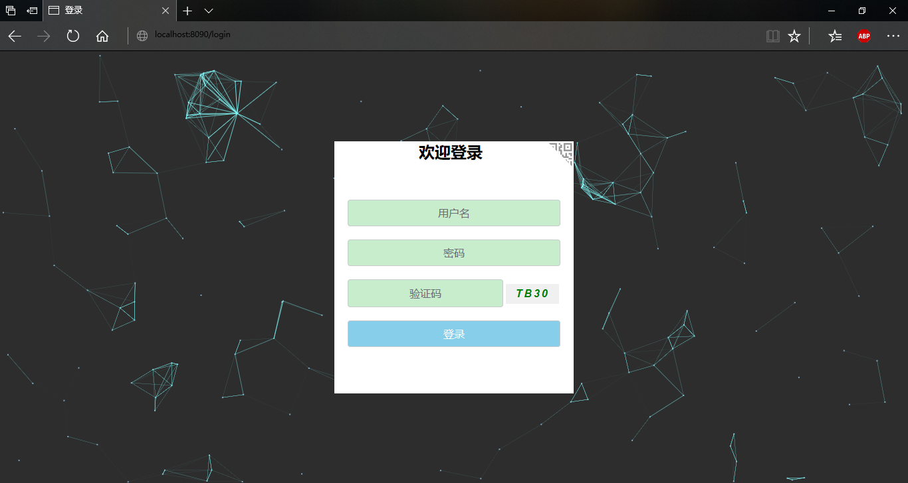
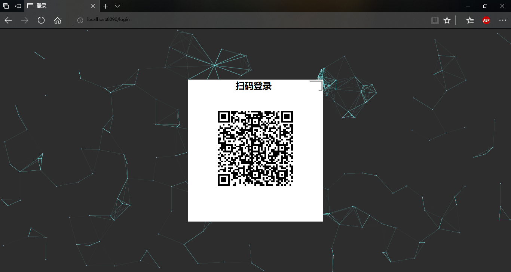
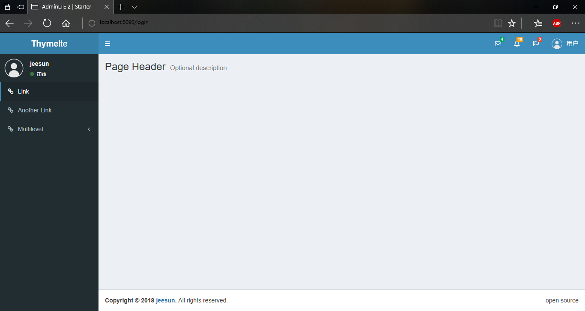

# thymelte

## 项目简介
这是一个基于Spring Boot+AdminLTE+Thymeleaf的管理端项目，目的是简便管理端的开发。
## 功能列表
- 登录页面：
1. 4种登录方式，用户名+密码，手机号+密码，邮箱+密码，app扫码；
2. 验证码；
- 管理页面：使用Thymeleaf将AdminLTE页面拆分成多个组件，降低耦合。
- 日志记录保存到文件。
- Druid监控功能。访问[http://localhost:8090/druid/index.html](http://localhost:8090/druid/index.html)，用户名druid，密码12345678。

## 截图

## 使用流程
1. 首先你需要建立PostgreSQL数据库。使用navicat执行`src/main/resources/schema-pg.sql`。
2. 修改`src/main/resources/applicaion.yml`的数据库连接信息：
- jasypt.encryptor.password: 用于数据库连接新息的jasypt加密的密码。最好自定义更复杂的密码。
- spring.datasource: 配置数据库连接信息。**注意，此处的用户名和密码信息必须是加密过后的字符串，不能是明文。加密是通过测试类UtilTests的jasyptTest方法进行的。**